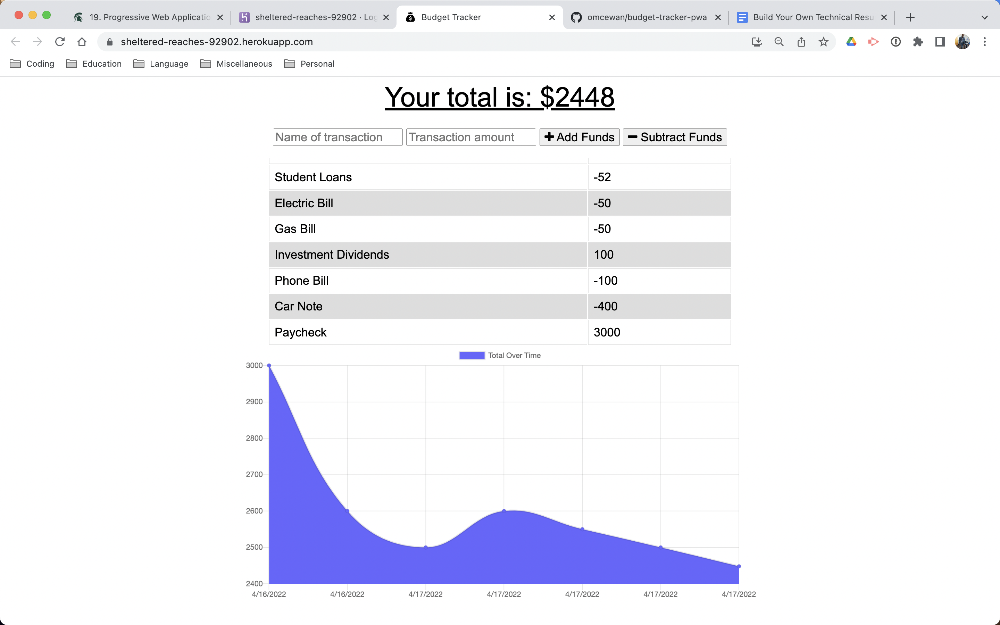
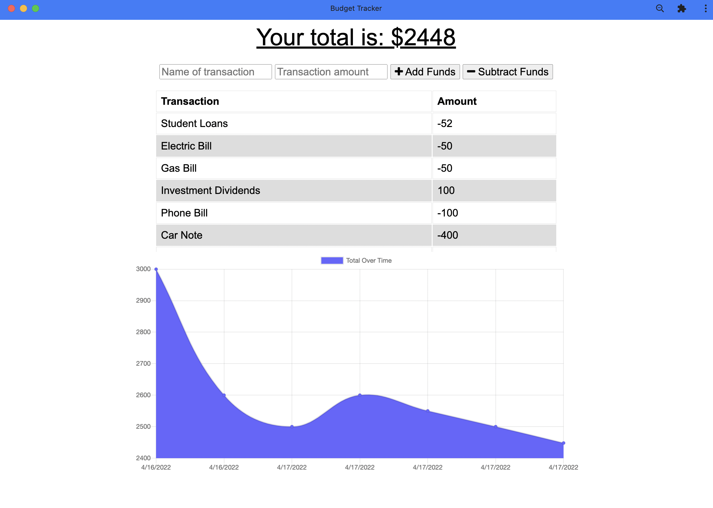
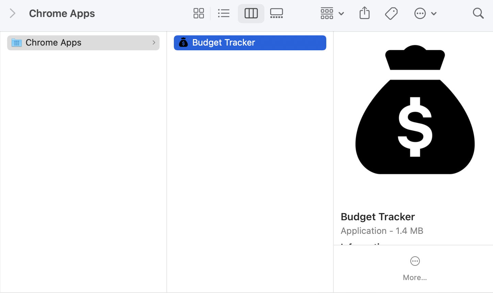

# Budget Tracker

## Table of Contents

- [Description](#Description)
- [Installation](#Installation)
- [Usage](#Usage)
- [Contribution](#Contribution)
- [License](#License)
- [Questions](#Questions)

## Description

Budget Tracker is an application designed to allow users to track their income and expense transactions. The application is designed to work offline using indexDB to store data when the system is offline and send the data to the server when it reconnects. Budget Tracker is also developed as a Progressive Web Application (PWA), which allows the user to down the application and use all its functionality. You can find and use Budget Tracker at - https://sheltered-reaches-92902.herokuapp.com/

## Built With

- JavaScript
- HTML
- Node
- Express
- MongoDB

## ScreenShot

## Installation

To install this application, clone or download the files from the repository, https://github.com/omcewan/budget-tracker-pwa. Here you will find all the files that are needed to run this application. You will need to have node.js and mongodb installed on you system, as this application was built using node.js and uses node to run and and mongoDB as the database. Once installed, from the command line run npm install (npm i, for short), which will then download all the dependencies of the application. Once successfully download the application is installed and running npm start will start the server and you can open the application at http://localhost:3001/.

## Usage

To use Budget Tracker, go to https://sheltered-reaches-92902.herokuapp.com/, here you can either download the application to your system or use it as is within your native browser. From the browser you can enter the name of the transaction, the amount and if its either an expense or income. The new transaction is then reflected in the chart below.

## Contribution

If you would like to contribute to the development of the application, first fork the application to your system and then once you have implemented your desired feature or bug fixes, submit a pull request which will then be reviewed.

## License

This application is covered under the MIT.
For more details about licensing, use this link: https://choosealicense.com/licenses/mit/.

## Questions

For additional information about the project, please find it at the following www.github.com/omcewan.
Also if you have additional questions please contact me at omcewan18@gmail.com.
